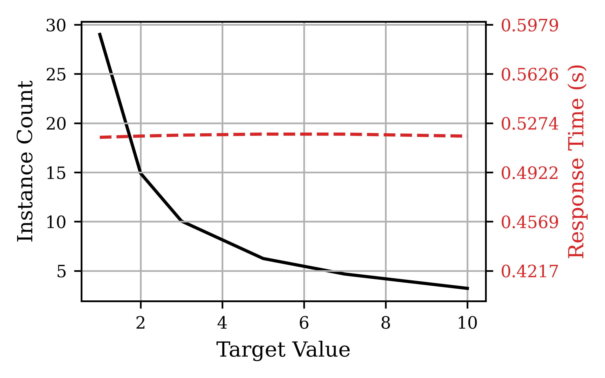

# Workloads for Testing Performance Model

This folder includes workloads used for testing performance models. We used a set of
configurable benchmarks with different types of workload integrated in them. Thus, by modifying
the requests made to each benchmark set, we can get a range of workloads that are a combination
of different types of tasks common in serverless computing. Here is a list of functions
used in this work:

- [Bench1](./bench1/)
- [Autoscale-Go](./autoscale-go/)

**NOTE: Please note that each of these functions include a combination of standard benchmarks used in
previous studies. A combination of these benchmarks can represent different levels of stress on different
resources of the virtual machines in the platform. You can find further details of these benchmarks
in their dedicated pages.**

## List of Workloads

Here is a list of workloads used in this study:

| Workload | Benchmarks | Parameters | RPS? |
|----------|------------|------------|------|
| Workload1 | Bench1 | sleep_base=1000, sleep_rand=200 | No |
| Workload2 | Autoscale-Go | sleep=500, prime=10000, bloat=5 | No |
| Workload3 | Autoscale-Go | sleep=500, prime=10000, bloat=5 | Yes |
| Workload4 | Bench1 | io={"rd": 3, "size": "200K", "cnt": 2},   cpu=10000, sleep=1000 | Yes |

## Workload 1 Results

| Experiment | Experimental Results | Model Prediction |
|------------|----------------------|------------------|
| ArrivalRate20 |  |  |

## Workload 2 Results

| Experiment | Experimental Results | Model Prediction |
|------------|----------------------|------------------|
| ArrivalRate20 |  |  |

## Workload 3 Results

| Experiment | Experimental Results | Model Prediction |
|------------|----------------------|------------------|
| ArrivalRate20 |  |  |

## Workload 4 Results

| Experiment | Experimental Results | Model Prediction |
|------------|----------------------|------------------|
| ArrivalRate20 |  |  |

## References

- [“Shutdown Signals with Docker Entry-point Scripts” by Benjamin Cane](https://link.medium.com/gIUHyPHzzbb)
- [Google CloudRun: Container Runtime Contract](https://cloud.google.com/run/docs/reference/container-contract)
